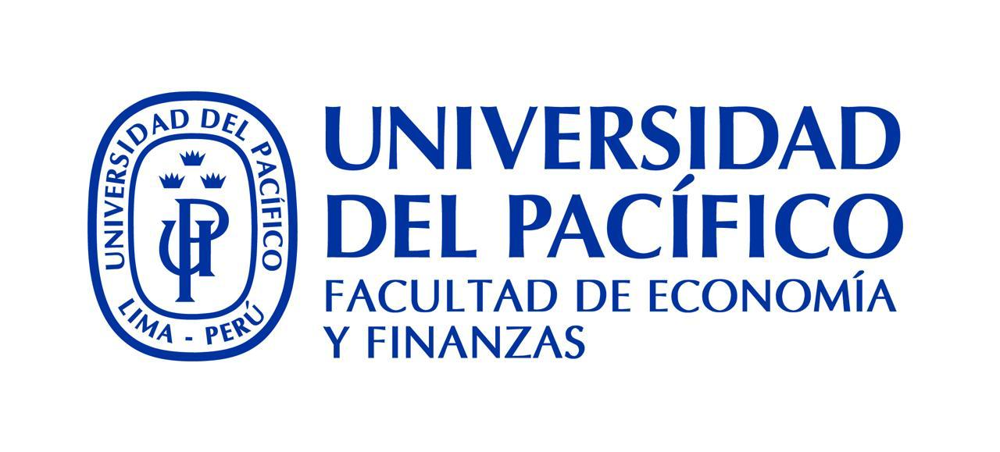

# 👤 Perfil Profesor

  

    
    <h3>Fernando Díaz H., PhD.</h3>
    <em>Profesor Economía & Finanzas</em> 
    <em>Director Programa MBA</em> 
    <em>Escuela de Negocios</em> 
    <em>Universidad Técnica Federico Santa María</em>  
    <ul class="edu-list">
      <li class="edu-line">🎓 Ph.D. in Finance </li>
      <li class="edu-line">🎓 M.Sc. in Finance and Economics </li>
      <li class="edu-line">🎓 M.A. &amp; Licentiate in Economics </li>
    </ul>
    📈 Focos: Finanzas, Econometría, Machine Learning, NLP 
    

      <a class="perfil-social-icon" href="https://www.linkedin.com/in/frdiazh/" target="_blank" rel="noopener" aria-label="LinkedIn">
        <svg role="img" viewBox="0 0 24 24" xmlns="http://www.w3.org/2000/svg"><path d="M20.447 20.452h-3.554v-5.569c0-1.328-.027-3.037-1.852-3.037-1.853 0-2.136 1.445-2.136 2.939v5.667H9.351V9h3.414v1.561h.046c.477-.9 1.637-1.85 3.37-1.85 3.601 0 4.267 2.37 4.267 5.455v6.286zM5.337 7.433c-1.144 0-2.063-.926-2.063-2.065 0-1.138.92-2.063 2.063-2.063 1.14 0 2.064.925 2.064 2.063 0 1.139-.925 2.065-2.064 2.065zm1.782 13.019H3.555V9h3.564v11.452zM22.225 0H1.771C.792 0 0 .774 0 1.729v20.542C0 23.227.792 24 1.771 24h20.451C23.2 24 24 23.227 24 22.271V1.729C24 .774 23.2 0 22.222 0h.003z"/></svg>
      </a>
      <a class="perfil-social-icon" href="https://github.com/fdiaz1968" target="_blank" rel="noopener" aria-label="GitHub">
        <svg role="img" viewBox="0 0 24 24" xmlns="http://www.w3.org/2000/svg"><path d="M12 .297c-6.63 0-12 5.373-12 12 0 5.303 3.438 9.8 8.205 11.385.6.113.82-.258.82-.577 0-.285-.01-1.04-.015-2.04-3.338.724-4.042-1.61-4.042-1.61C4.422 18.07 3.633 17.7 3.633 17.7c-1.087-.744.084-.729.084-.729 1.205.084 1.838 1.236 1.838 1.236 1.07 1.835 2.809 1.305 3.495.998.108-.776.417-1.305.76-1.605-2.665-.3-5.466-1.332-5.466-5.93 0-1.31.465-2.38 1.235-3.22-.135-.303-.54-1.523.105-3.176 0 0 1.005-.322 3.3 1.23.96-.267 1.98-.399 3-.405 1.02.006 2.04.138 3 .405 2.28-1.552 3.285-1.23 3.285-1.23.645 1.653.24 2.873.12 3.176.765.84 1.23 1.91 1.23 3.22 0 4.61-2.805 5.625-5.475 5.92.42.36.81 1.096.81 2.22 0 1.606-.015 2.896-.015 3.286 0 .315.21.69.825.57C20.565 22.092 24 17.592 24 12.297c0-6.627-5.373-12-12-12"/></svg>
      </a>
      <a class="perfil-social-icon" href="https://orcid.org/0000-0003-1088-9600" target="_blank" rel="noopener" aria-label="ORCID">
        <svg role="img" viewBox="0 0 24 24" xmlns="http://www.w3.org/2000/svg"><path d="M12 0C5.372 0 0 5.372 0 12s5.372 12 12 12 12-5.372 12-12S18.628 0 12 0zM7.369 4.378c.525 0 .947.431.947.947s-.422.947-.947.947a.95.95 0 0 1-.947-.947c0-.525.422-.947.947-.947zm-.722 3.038h1.444v10.041H6.647V7.416zm3.562 0h3.9c3.712 0 5.344 2.653 5.344 5.025 0 2.578-2.016 5.025-5.325 5.025h-3.919V7.416zm1.444 1.303v7.444h2.297c3.272 0 4.022-2.484 4.022-3.722 0-2.016-1.284-3.722-4.097-3.722h-2.222z"/></svg>
      </a>
    

  

---

  

> 👆 Fernando Díaz H. dicta el curso de Procesamiento de Lenguaje Natural en la Universidad Técnica Federico Santa María y en la Universidad del Pacífico de Lima.

## Sobre el Curso

**Procesamiento de Lenguaje Natural — Análisis Textual con R y Python** es un curso intensivo (Semana Internacional) que combina métodos estadísticos clásicos (R / Quanteda) con modelos transformer y LLM (Python / HuggingFace) para el análisis de textos en ciencias sociales, economía y finanzas.

Revisa el [Programa](programa.md) para la descripción completa del curso, objetivos y contenidos, o entra directo a las [Clases](clases/clases.md) para acceder a los notebooks de cada unidad.
